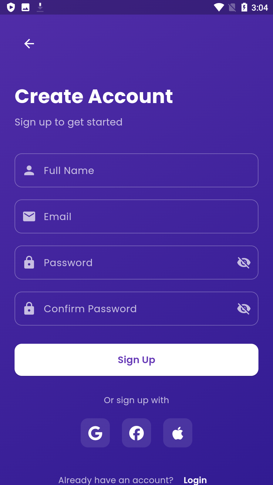
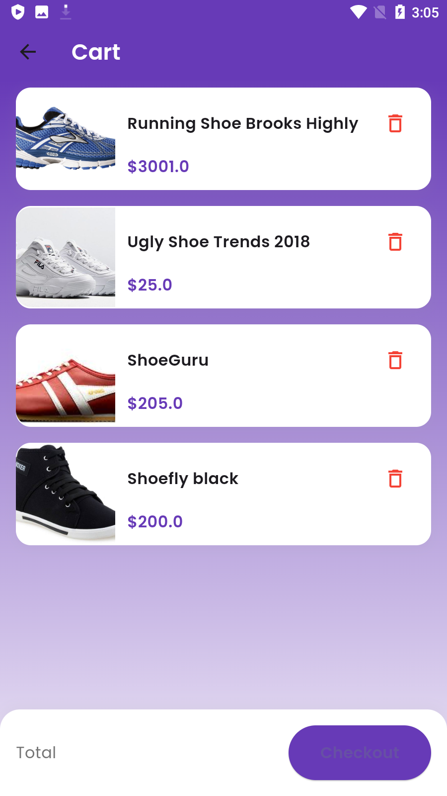
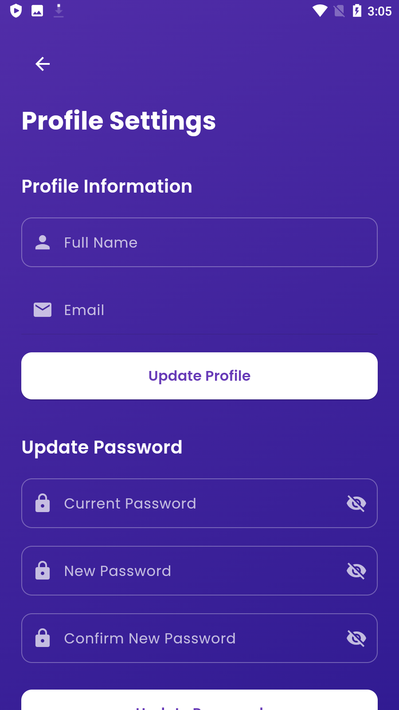
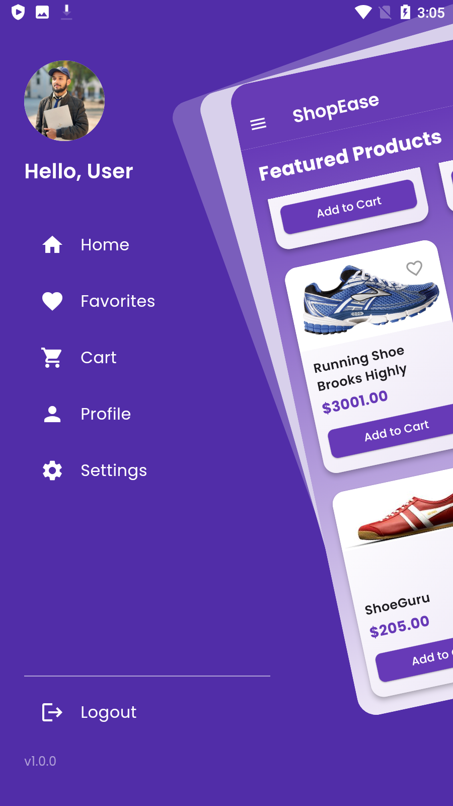

<div align="center">
  <h1>
    ShopEase - Modern E-Commerce App
  </h1>
  <h3>Your One-Stop Shopping Destination</h3>
</div>

## 📸 Banner
<p align="center">
    
</p>

<p align="center">
    
    
    
</p>

## 📸 Screenshots

### Welcome & Authentication

<table border="1">
  <tr>
    <td align="center">
      
      <p><b>Welcome Screen</b></p>
    </td>
    <td align="center">
      
      <p><b>Login Screen</b></p>
    </td>
    <td align="center">
      
      <p><b>Sign Up Screen</b></p>
    </td>
  </tr>
</table>

### Main Features

<table border="1">
  <tr>
    <td align="center">
      
      <p><b>Home Page</b></p>
    </td>
    <td align="center">
      
      <p><b>Shopping Cart</b></p>
    </td>
    <td align="center">
      
      <p><b>Favorites</b></p>
    </td>
  </tr>
</table>

### User Profile & Settings

<table border="1">
  <tr>
    <td align="center">
      
      <p><b>Profile Update</b></p>
    </td>
    <td align="center">
      
      <p><b>Settings</b></p>
    </td>
    <td align="center">
      
      <p><b>Navigation Drawer</b></p>
    </td>
  </tr>
</table>

## 📱 Features

- **Modern UI**: Beautiful, intuitive interface with smooth animations
- **Authentication**: Secure login and signup system
- **Shopping Cart**: Add and manage items in your cart
- **Favorites**: Save your favorite items for quick access
- **User Profiles**: Create and manage your personal profile
- **Product Details**: View comprehensive information about each product
- **Offline Support**: Access your cart and favorites without internet
- **Responsive Design**: Works seamlessly on all screen sizes

## 🚀 Tech Stack

- **Flutter** (UI Framework)
- **GetX** (State Management)
- **Shared Preferences** (Local Storage)
- **Flutter Animate** (Animation Library)
- **Material Design 3**
- **Custom Animations**

## 🔑 Key Features

- ✅ **Shopping Cart**: Add and manage items in your cart
- ✅ **Favorites**: Save and access your favorite items
- ✅ **User Authentication**: Secure login and signup
- ✅ **Profile Management**: Customize your user profile
- ✅ **Beautiful UI**: Modern and intuitive interface with animations
- ✅ **Offline Access**: Access your cart and favorites without internet
- ✅ **Product Management**: Browse and view detailed product information

## 📖 How to Use

1. **Browse Products**
   - View products on the home page
   - Add items to cart
   - Save favorites for later

2. **Manage Cart**
   - Add/remove items
   - Update quantities
   - Proceed to checkout

3. **Update Profile**
   - Change personal information
   - Update profile picture
   - Manage account settings

4. **Track Orders**
   - View order history
   - Track current orders
   - Manage deliveries

## Project Structure

```
lib/
├── screens/
│   ├── welcome_screen.dart
│   ├── login_screen.dart
│   ├── signup_screen.dart
│   ├── home_screen.dart
│   ├── cart_screen.dart
│   ├── favorites_screen.dart
│   ├── profile_screen.dart
│   └── settings_screen.dart
├── models/
│   ├── product_model.dart
│   └── user_model.dart
├── controllers/
│   ├── auth_controller.dart
│   ├── cart_controller.dart
│   └── home_controller.dart
├── widgets/
│   ├── theme/
│   │   ├── app_colors.dart
│   │   └── app_theme.dart
│   ├── constants/
│   │   ├── strings.dart
│   │   └── assets.dart
│   └── product_card.dart
└── main.dart
```

## 📱 Download

Get the latest version of ShopEase from the [releases page](APK/app-release.apk).

## 📝 License

This project is licensed under the MIT License - see the LICENSE file for details.
